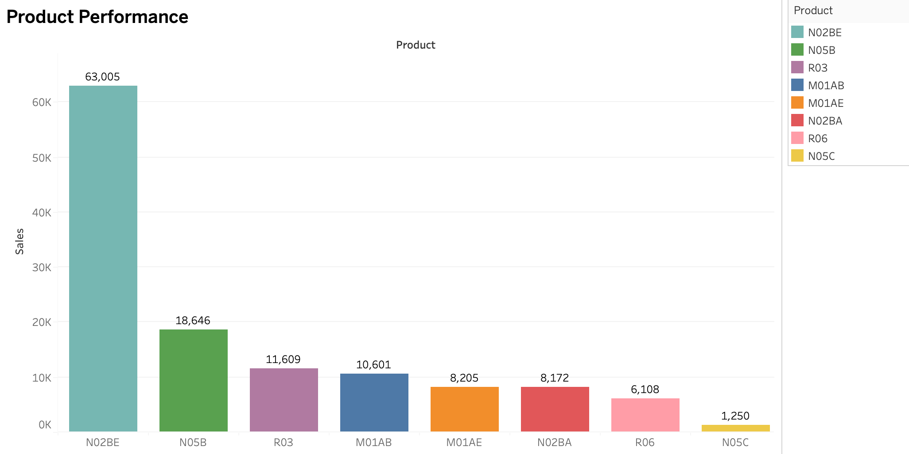
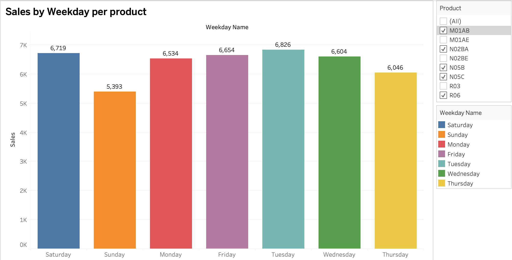
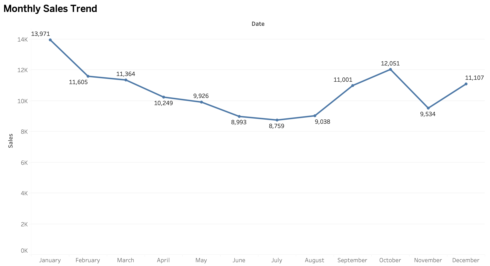

# Pharma Sales Analytics & Reporting Automation

## Overview

This project analyzes pharmaceutical sales performance and automates reporting processes through interactive dashboards and business intelligence solutions.

The dashboard focuses on:

- Product performance analysis
- Monthly sales trends
- Weekday sales behavior
- Reporting automation
- Business performance monitoring

## Business Problem

Manual reporting processes often delay decision-making and make it difficult to identify sales trends across products and time periods.

This solution provides interactive dashboards that enable stakeholders to monitor performance, identify opportunities, and make data-driven decisions.

## Dataset

The analysis was performed on pharmaceutical sales transaction data containing product-level sales records, transaction dates, and performance metrics.

## Tools Used

- Power BI
- Power Query
- Excel
- Data Visualization
- Business Intelligence
- Reporting Automation

## Key Findings

- Product N02BE generated the highest sales volume, contributing over 63,000 units and significantly outperforming other products.

- Sales remained relatively stable throughout the year, with strong performance observed in January, September, October, and December.

- Tuesday generated the highest sales volume among weekdays, while Sunday recorded the lowest sales activity.

- Product performance was highly concentrated, with the top three products accounting for the majority of total sales.

## Business Impact

This dashboard enables stakeholders to:

- Monitor sales performance in real time
- Identify top-performing products
- Detect seasonal sales patterns
- Optimize inventory planning
- Reduce manual reporting effort through automation

## Dashboard Screenshots

### Product Performance

### Monthly Sales Trend

### Sales by Weekday

## Author

Manasvi Gandhi
